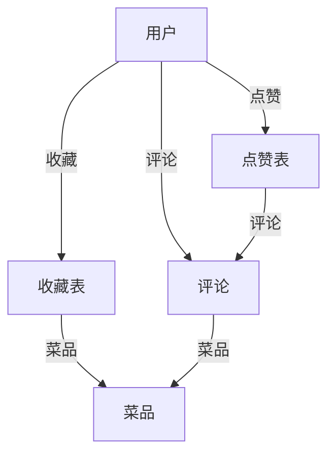

# “工大吃喝”校园餐饮点评系统

## 项目简介

本系统为本校师生提供一站式食堂菜品浏览、评价、收藏、点赞与智能推荐服务。 用户可浏览各校区食堂菜品、收藏喜欢的菜品、点赞优质评论、发表评价、获取个性化推荐。系统采用Spring Boot + MyBatis + MySQL后端，HTML5/CSS3/JS前端，界面美观，交互流畅，支持多端访问。

---

## 主要功能

### 用户端
- **注册/登录/登出**：支持用户注册、登录、会话管理
- **菜品浏览与筛选**：按校区、食堂、档口筛选菜品，支持关键词搜索
- **菜品详情**：查看菜品详细信息、图片、价格、简介、评分与评论
- **评论与评分**：登录用户可对菜品进行1-5星评分与评论，支持评论管理
- **收藏菜品**：一键收藏/取消收藏，个人中心可查看我的收藏
- **点赞评论**：对优质评论点赞，个人中心可查看我的点赞
- **个人中心**：管理个人信息、修改密码、查看我的评论/收藏/点赞
- **智能推荐**：
  - **随机推荐**：一键获取随机菜品，提供开盲盒般的体验
  - **问问AI**：输入个性化需求，通义AI结合数据库智能推荐菜品

### 管理端（预留）
- 用户、菜品、评论管理，数据统计（暂未实现）

---

## 技术架构

- **后端**：Spring Boot 3.x、Spring MVC、MyBatis、MySQL
- **前端**：HTML5、CSS3、JavaScript (ES6+)、Thymeleaf（部分页面）
- **接口**：RESTful API，前后端分离
- **UI**：响应式设计，现代化自定义CSS

---

## 数据库结构

### 1. 用户表 user
| 字段名      | 类型         | 说明         |
| ----------- | ------------ | ------------ |
| user_id     | INT, PK, AI  | 用户ID       |
| name        | VARCHAR(50)  | 用户名       |
| password    | VARCHAR(255) | 密码|
| phone       | VARCHAR(20)  | 手机号       |

### 2. 菜品表 dish
| 字段名      | 类型         | 说明         |
| ----------- | ------------ | ------------ |
| dish_id     | INT, PK, AI  | 菜品ID       |
| dish_name   | VARCHAR(100) | 菜品名称     |
| campus      | VARCHAR(100) | 校区         |
| canteen     | VARCHAR(100) | 食堂         |
| stall       | VARCHAR(100) | 档口         |
| price       | VARCHAR(255) | 价格         |
| image_url   | VARCHAR(255) | 图片URL      |
| description | VARCHAR(500) | 菜品简介     |

### 3. 评论表 comment
| 字段名      | 类型         | 说明         |
| ----------- | ------------ | ------------ |
| comment_id  | INT, PK, AI  | 评论ID       |
| user_id     | INT, FK      | 用户ID       |
| dish_id     | INT, FK      | 菜品ID       |
| rating      | INT          | 评分（1-5）  |
| content     | TEXT         | 评论内容     |
| created_at  | DATETIME     | 评论时间     |

### 4. 收藏表 user_favorite_dish
| 字段名      | 类型         | 说明         |
| ----------- | ------------ | ------------ |
| id          | INT, PK, AI  | 主键         |
| user_id     | INT, FK      | 用户ID       |
| dish_id     | INT, FK      | 菜品ID       |
| created_at  | DATETIME     | 收藏时间     |

### 5. 点赞表 user_like_comment
| 字段名      | 类型         | 说明         |
| ----------- | ------------ | ------------ |
| id          | INT, PK, AI  | 主键         |
| user_id     | INT, FK      | 用户ID       |
| comment_id  | INT, FK      | 评论ID       |
| created_at  | DATETIME     | 点赞时间     |

---

## 主要页面与路由

| 路径                  | 说明                 |
|----------------------|----------------------|
| `/`                  | 首页/系统介绍        |
| `/login`             | 登录页面             |
| `/register`          | 注册页面             |
| `/dishes`            | 菜品列表             |
| `/dish-detail`       | 菜品详情             |
| `/profile`           | 个人中心（评论/收藏/点赞）|
| `/recommendations`   | 智能推荐             |

---

## 主要API接口

- `POST   /api/users/register`         用户注册
- `POST   /api/users/login`            用户登录
- `POST   /api/users/logout`           退出登录
- `GET    /api/users/current`          获取当前登录用户
- `GET    /api/dishes`                 获取菜品列表（支持筛选/搜索/排序）
- `GET    /api/dishes/{id}`            获取菜品详情
- `POST   /api/dishes`                 添加菜品
- `GET    /api/dishes/random`          随机推荐一道菜品
- `POST   /api/ai/simple`              AI智能推荐
- `GET    /api/comments/dish/{dishId}` 获取某菜品评论
- `POST   /api/comments`               添加评论
- `POST   /api/favorites`              收藏菜品
- `DELETE /api/favorites/{dishId}`     取消收藏
- `GET    /api/favorites/check`        查询收藏状态
- `GET    /api/favorites/user`         获取我的收藏
- `POST   /api/likes`                  点赞评论
- `DELETE /api/likes/{commentId}`      取消点赞
- `GET    /api/likes/check`            查询点赞状态
- `GET    /api/likes/user`             获取我的点赞

---

## 运行与部署

1. 安装JDK 21+、Maven 3.6+、MySQL 8.0+
2. 配置 `src/main/resources/application.properties` 数据库连接
3. 初始化数据库，执行 `mybatis/user.sql`、`dish.sql`、`comment.sql`、`user_favorite_dish.sql`、`user_like_comment.sql`
4. 启动项目：
   ```bash
   mvn spring-boot:run
   ```
5. 访问 http://localhost:8082

---

## 系统结构与映射关系



- 用户可收藏菜品、点赞评论，所有操作均有唯一性约束，防止重复收藏/点赞
- 个人中心可查看我的评论、收藏、点赞，支持tab切换
- 推荐页支持随机推荐与AI智能推荐

---

## 代码结构

```
src/
  main/
    java/org/comment/
      controller/   // 控制器，REST API
      entity/       // 实体类
      mapper/       // MyBatis接口
      service/      // 业务逻辑
      service/impl/ // 业务实现
    resources/
      static/       // 前端静态资源（css/js/images）
      templates/    // Thymeleaf模板
      mybatis/      // MyBatis XML
      application.properties // 配置
  test/
    ...             // 单元测试
```

---

## 其它说明

- 核心后端/前端文件有详细注释，便于理解
- 数据库SQL文件副本见 `MySQL-copy/` 目录
- 管理员功能与AI多菜品推荐与自动定向暂未完善，可继续扩展

---

