# “工大吃喝”校园餐饮点评与智能推荐系统

## 项目简介

本系统面向高校师生，构建了一个集 **菜品浏览、标签筛选、评论互动、热度统计、收藏点赞与智能推荐** 于一体的校园餐饮服务平台。用户可以按校区、食堂、档口及多级标签快速检索菜品，查看菜品详情与他人评价，并结合系统提供的热度榜、随机推荐和 AI 推荐入口，获得更符合个人需求的用餐建议。

系统以 **“标签细分 + 智能推荐”** 为核心创新点，在传统菜品评价系统基础上，引入多级标签树、多维热度指标与场景化推荐机制，适合作为本科毕设中的“业务完整、结构清晰、具有一定创新性”的校园信息化项目。

---

## 功能特性

### 用户端功能

| 功能模块 | 具体功能 | 说明 |
|---------|----------|------|
| 用户认证 | 注册 / 登录 / 登出 / 会话管理 | 支持基于 Session 的登录状态维护 |
| 菜品浏览 | 菜品列表、菜品详情、图片展示 | 支持从列表进入详情查看价格、简介、标签、评论等信息 |
| 条件筛选 | 关键词搜索、标签筛选、多条件组合筛选 | 支持按标签树进行多选筛选，并兼容校区/食堂/档口维度 |
| 标签系统 | 多级标签、点击即选、动态展示 | 标签覆盖口味、品类、价格、营养、场景等多个维度 |
| 评论互动 | 评分、发表评论、查看评论统计 | 支持评分分布、平均分、评论数等统计 |
| 点赞互动 | 评论点赞 / 取消点赞 | 用于构建评论热度与用户互动行为 |
| 收藏功能 | 收藏菜品 / 取消收藏 | 收藏记录可在个人中心查看 |
| 个人中心 | 资料查看与修改、修改密码、个人简介、我的评论、我的收藏、我的点赞 | 支持异步加载个人数据 |
| 推荐服务 | 随机推荐、热度榜推荐、标签筛选推荐、AI 智能推荐 | AI 推荐已支持本地规则推荐、百炼增强接入与失败自动降级 |

### 管理端功能（当前为预留/逐步完善）

| 功能模块 | 规划内容 | 当前状态 |
|---------|----------|----------|
| 菜品管理 | 菜品新增、编辑、上下架、审核 | 已预留页面/可继续完善 |
| 标签管理 | 标签树维护、层级调整、有效性校验 | 已具备标签表基础，可继续扩展管理能力 |
| 评论管理 | 评论查看、删除、审核 | 页面可扩展，后端可继续补充 |
| 数据分析 | 热度变化、用户偏好、销量趋势 | 作为后续增强方向 |
| 决策支持 | 基于数据分析给出采购建议 | 毕设扩展方向 |

### 系统特色

- **多级标签细分**：围绕菜品品类、风味、价格、营养、适宜场景等建立层级化标签体系。
- **多行为热度指标**：基于评论数、点赞数、收藏数等数据构建菜品热度榜。
- **AI 推荐双阶段设计**：当前已实现本地规则推荐，并支持阿里云百炼应用增强接入与失败降级。
- **良好的扩展性**：当前为 Web 端实现，后续可在保留后端接口的基础上迁移至微信小程序。

---

## 功能实现状态

| 模块 | 功能项 | 当前状态 | 说明 |
|------|--------|----------|------|
| 用户模块 | 注册 / 登录 / 登出 | 已实现 | 支持登录态维护 |
| 用户模块 | 当前用户信息获取 | 已实现 | 用于前端鉴权与页面展示 |
| 用户模块 | 修改资料 / 修改密码 / 个人简介 | 已实现 | 个人中心可调用 |
| 菜品模块 | 菜品列表 / 详情 | 已实现 | 支持前后端联动展示 |
| 菜品模块 | 搜索与组合筛选 | 已实现 | 支持关键词与多条件组合 |
| 标签模块 | 多级标签树筛选 | 已实现 | 支持点击选择、动态展示 |
| 评论模块 | 评论新增 / 删除 / 查询 | 已实现 | 支持按菜品、按用户查询 |
| 评论模块 | 评分统计 | 已实现 | 包括平均分、评论数、评分分布 |
| 互动模块 | 收藏菜品 | 已实现 | 个人中心可查看 |
| 互动模块 | 评论点赞 | 已实现 | 用于热度统计 |
| 推荐模块 | 随机推荐 | 已实现 | 推荐页可直接调用 |
| 推荐模块 | 热度榜推荐 | 已实现 | 依据互动行为聚合排序 |
| 推荐模块 | AI 推荐 | 已实现 | 已支持自然语言输入、预算识别、摘要生成、菜品卡片返回与跟进问题提示 |
| 推荐模块 | 百炼应用增强 | 已实现（可配置） | 配置完成后可调用阿里云百炼；失败时自动回退本地推荐 |
| 管理后台 | 后台管理功能 | 部分预留 | 页面与结构可扩展 |

---

## 技术结构

### 总体技术栈

| 层次 | 技术/工具 | 说明 |
|------|-----------|------|
| 后端框架 | Spring Boot 3.x | 项目主框架，负责启动、依赖管理与 Web 能力 |
| Web层 | Spring MVC + WebFlux | MVC 提供接口与页面路由，WebFlux 的 `WebClient` 用于调用百炼 API |
| 持久层 | MyBatis | 实现数据库访问与 SQL 映射 |
| 数据库 | MySQL 8.x | 存储用户、菜品、评论、标签、收藏、点赞等数据 |
| 前端 | HTML5 + CSS3 + JavaScript | 实现页面结构、样式与交互逻辑 |
| 模板引擎 | Thymeleaf | 负责部分页面模板渲染 |
| 构建工具 | Maven | 项目依赖管理与构建 |
| 运行环境 | JDK 17+ | Java 运行时环境 |

### 系统架构说明

- **前端展示层**：负责页面渲染、筛选交互、表单提交、异步请求。
- **控制层（Controller）**：接收前端请求，完成参数处理、登录校验与响应封装。
- **业务层（Service）**：实现用户、菜品、评论、标签、收藏、点赞、推荐等业务逻辑。
- **数据访问层（Mapper）**：通过 MyBatis 与 MySQL 数据库进行交互。
- **数据库层（MySQL）**：负责系统核心业务数据持久化存储。

---

## 数据库设计

### 1. 核心实体关系

- `user`（用户）`1 --- n` `comment`（评论）
- `user`（用户）`1 --- n` `user_favorite_dish`（收藏关系）`n --- 1` `dish`（菜品）
- `user`（用户）`1 --- n` `user_like_comment`（点赞关系）`n --- 1` `comment`（评论）
- `dish`（菜品）`1 --- n` `comment`（评论）
- `dish`（菜品）`n --- n` `tag`（标签），通过 `dish_tag` 关联
- `tag`（标签）通过 `parent_id` 形成多级树结构

### 2. 数据表结构

#### 2.1 用户表 `user`

| 字段名 | 类型 | 说明 |
|--------|------|------|
| `user_id` | INT / BIGINT，PK | 用户主键 |
| `name` | VARCHAR | 用户名 |
| `password` | VARCHAR | 登录密码 |
| `phone` | VARCHAR | 手机号 |
| `bio` | VARCHAR / TEXT | 个人简介 |
| `created_at` | DATETIME | 创建时间 |
| `updated_at` | DATETIME | 更新时间 |

#### 2.2 菜品表 `dish`

| 字段名 | 类型 | 说明 |
|--------|------|------|
| `dish_id` | INT / BIGINT，PK | 菜品主键 |
| `dish_name` | VARCHAR | 菜品名称 |
| `campus` | VARCHAR | 校区 |
| `canteen` | VARCHAR | 食堂 |
| `stall` | VARCHAR | 档口 |
| `price` | DECIMAL / VARCHAR | 价格 |
| `image_url` | VARCHAR | 菜品图片地址 |
| `description` | TEXT | 菜品描述 |
| `created_at` | DATETIME | 创建时间 |
| `updated_at` | DATETIME | 更新时间 |

#### 2.3 评论表 `comment`

| 字段名 | 类型 | 说明 |
|--------|------|------|
| `comment_id` | INT / BIGINT，PK | 评论主键 |
| `user_id` | INT / BIGINT，FK | 评论用户 |
| `dish_id` | INT / BIGINT，FK | 对应菜品 |
| `rating` | INT | 评分（1-5） |
| `content` | TEXT | 评论内容 |
| `created_at` / `comment_time` | DATETIME | 评论时间 |

#### 2.4 标签表 `tag`

| 字段名 | 类型 | 说明 |
|--------|------|------|
| `tag_id` | INT / BIGINT，PK | 标签主键 |
| `name` | VARCHAR | 标签名称 |
| `parent_id` | INT / BIGINT | 父标签 ID |
| `path` | VARCHAR | 标签路径，便于树结构展示 |
| `level` | INT | 标签层级 |
| `sort` | INT | 排序值 |
| `created_at` | DATETIME | 创建时间 |
| `updated_at` | DATETIME | 更新时间 |

#### 2.5 菜品标签关联表 `dish_tag`

| 字段名 | 类型 | 说明 |
|--------|------|------|
| `id` | INT / BIGINT，PK | 主键 |
| `dish_id` | INT / BIGINT，FK | 菜品 ID |
| `tag_id` | INT / BIGINT，FK | 标签 ID |
| `created_at` | DATETIME | 创建时间 |

#### 2.6 收藏表 `user_favorite_dish`

| 字段名 | 类型 | 说明 |
|--------|------|------|
| `id` | INT / BIGINT，PK | 主键 |
| `user_id` | INT / BIGINT，FK | 用户 ID |
| `dish_id` | INT / BIGINT，FK | 菜品 ID |
| `created_at` | DATETIME | 收藏时间 |

#### 2.7 评论点赞表 `user_like_comment`

| 字段名 | 类型 | 说明 |
|--------|------|------|
| `id` | INT / BIGINT，PK | 主键 |
| `user_id` | INT / BIGINT，FK | 用户 ID |
| `comment_id` | INT / BIGINT，FK | 评论 ID |
| `created_at` | DATETIME | 点赞时间 |

### 3. ER 与逻辑说明

| 关系 | 说明 |
|------|------|
| 用户 - 评论 | 一个用户可以发表多条评论，一条评论只属于一个用户 |
| 菜品 - 评论 | 一个菜品可以拥有多条评论，一条评论只对应一个菜品 |
| 用户 - 收藏 - 菜品 | 用户可收藏多个菜品，一个菜品也可被多个用户收藏 |
| 用户 - 点赞 - 评论 | 用户可点赞多条评论，一条评论也可被多个用户点赞 |
| 菜品 - 标签 | 一个菜品可对应多个标签，一个标签也可关联多个菜品 |
| 标签树结构 | 标签通过父子关系构建一级标签、二级标签等层级结构 |

---

## API 接口规范

### 1. 用户相关接口

| 请求方式 | 接口路径 | 功能说明 |
|----------|----------|----------|
| POST | `/api/users/register` | 用户注册 |
| POST | `/api/users/login` | 用户登录 |
| POST | `/api/users/logout` | 用户退出登录 |
| GET | `/api/users/current` | 获取当前登录用户 |
| GET | `/api/users/{id}` | 获取用户信息 |
| PUT | `/api/users/{id}` | 更新用户信息 |
| PUT | `/api/users/{id}/password` | 修改密码 |
| PUT | `/api/users/{id}/bio` | 更新个人简介 |
| DELETE | `/api/users/{id}` | 删除用户 |

### 2. 菜品与标签相关接口

| 请求方式 | 接口路径 | 功能说明 |
|----------|----------|----------|
| GET | `/api/dishes` | 获取菜品列表，支持搜索、筛选、分页 |
| GET | `/api/dishes/{id}` | 获取菜品详情 |
| POST | `/api/dishes` | 添加菜品 |
| PUT | `/api/dishes/{id}` | 更新菜品 |
| DELETE | `/api/dishes/{id}` | 删除菜品 |
| GET | `/api/dishes/campuses` | 获取校区列表 |
| GET | `/api/dishes/canteens` | 获取食堂列表 |
| GET | `/api/dishes/stalls` | 获取档口列表 |
| GET | `/api/dishes/random` | 获取随机推荐菜品 |
| GET | `/api/tags/tree` | 获取标签树 |
| POST | `/api/tags` | 新增标签 |
| PUT | `/api/tags/{id}` | 更新标签 |
| DELETE | `/api/tags/{id}` | 删除标签 |

### 3. 评论、收藏、点赞相关接口

| 请求方式 | 接口路径 | 功能说明 |
|----------|----------|----------|
| POST | `/api/comments` | 发表评论 |
| GET | `/api/comments/dish/{dishId}` | 获取指定菜品评论 |
| GET | `/api/comments/dish/{dishId}/with-user-info` | 获取带用户信息的菜品评论 |
| GET | `/api/comments/user/{userId}` | 获取指定用户评论 |
| GET | `/api/comments/user/{userId}/with-dish-info` | 获取带菜品信息的用户评论 |
| GET | `/api/comments/{commentId}` | 获取评论详情 |
| DELETE | `/api/comments/{commentId}` | 删除评论 |
| GET | `/api/comments/dish/{dishId}/stats` | 获取菜品评分统计 |
| GET | `/api/comments/dish/{dishId}/user/{userId}/exists` | 检查用户是否已评论 |
| POST | `/api/favorites` | 收藏菜品 |
| DELETE | `/api/favorites/{dishId}` | 取消收藏 |
| GET | `/api/favorites/check?dishId=` | 检查收藏状态 |
| POST | `/api/likes` | 点赞评论 |
| DELETE | `/api/likes/{commentId}` | 取消点赞 |
| GET | `/api/likes/check?commentId=` | 检查点赞状态 |

### 4. AI 推荐接口

| 请求方式 | 接口路径 | 功能说明 |
|----------|----------|----------|
| POST | `/api/ai/simple` | 接收自然语言需求与预算信息，返回推荐摘要、说明文本、推荐菜品卡片、匹配偏好与跟进问题 |

### 5. 接口响应格式

#### 通用响应格式

```json
{
  "success": true,
  "message": "操作成功",
  "data": {}
}
```

#### 分页响应格式

```json
{
  "content": [],
  "totalPages": 1,
  "currentPage": 0,
  "totalSize": 10,
  "size": 10
}
```

---

## 页面路由说明

| 路径 | 页面说明 | 状态 |
|------|----------|------|
| `/` | 首页 / 系统介绍 / 热门菜品入口 | 已实现 |
| `/login` | 登录页面 | 已实现 |
| `/register` | 注册页面 | 已实现 |
| `/home` | 主页 | 已实现 / 可按实际入口使用 |
| `/dishes` | 菜品列表与筛选页面 | 已实现 |
| `/dish-detail` | 菜品详情页面 | 已实现 |
| `/comments` | 我的评论页面 | 已实现 |
| `/profile` | 个人中心页面 | 已实现 |
| `/add-comment` | 添加评论页面 | 已实现 / 可由详情页跳转 |
| `/recommendations` | 推荐页面（随机推荐 / 热度榜 / AI 智能推荐） | 已实现 |
| `/admin/users` | 管理员-用户管理 | 预留 |
| `/admin/dishes` | 管理员-菜品管理 | 预留 |
| `/admin/comments` | 管理员-评论管理 | 预留 |
| `/admin/stats` | 管理员-统计报表 | 预留 |

---

## 前端交互与页面说明

| 页面 | 主要内容 | 交互亮点 |
|------|----------|----------|
| 首页 | 系统介绍、热门菜品、导航入口 | 用于展示系统定位与功能入口 |
| 菜品列表页 | 菜品卡片、搜索栏、标签筛选栏 | 支持标签横向筛选、子标签弹层选择、选中变色反馈 |
| 菜品详情页 | 菜品信息、评分统计、评论列表、收藏入口 | 支持评论展示、点赞互动、收藏状态展示 |
| 推荐页 | 随机推荐、热度榜、AI 智能推荐 | 支持快捷需求标签、预算选择、推荐摘要、菜品卡片、跟进问题、图片预览与自适应滚动展示 |
| 个人中心页 | 个人资料、我的评论、我的收藏、我的点赞 | 支持异步加载与信息修改 |

---

## 运行环境与部署

### 环境要求

| 项目 | 版本要求 |
|------|----------|
| JDK | 17 及以上 |
| Maven | 3.6 及以上 |
| MySQL | 8.0 及以上 |

### 配置说明

请在 `src/main/resources/application.properties` 中配置数据库连接信息，例如：

```properties
spring.datasource.url=jdbc:mysql://localhost:3306/mybatis?useSSL=false&serverTimezone=UTC
spring.datasource.username=root
spring.datasource.password=password
server.port=8082
```

AI 推荐相关配置示例：

```properties
ai.enabled=true
ai.provider=bailian-app
ai.mode=application
ai.api-key-env-name=DASHSCOPE_API_KEY
ai.default-count=3
ai.keyword-fallback=true
ai.bailian.base-url=https://dashscope.aliyuncs.com/compatible-mode/v1
ai.bailian.app-id=你的百炼应用ID
ai.bailian.knowledge-base-id=可选
ai.bailian.model=qwen-plus
ai.bailian.workspace-id=可选
```

### 百炼接入步骤

1. 在阿里云百炼创建应用或智能体，并绑定你的餐品知识库。
2. 获取 `AppId`，填入 `ai.bailian.app-id`。
3. 在系统环境变量中配置 API Key：

```powershell
setx DASHSCOPE_API_KEY "你的DashScope-API-Key"
```

4. 重启终端或 IDE 后启动项目。
5. 若百炼调用失败，系统会自动回退到本地规则推荐，不影响页面使用。

### 数据库初始化

项目数据库初始化 SQL 位于 `MySQL-copy/` 目录，可根据当前数据库重构后的实际情况执行对应脚本，常见包括：

- `user.sql`
- `dish.sql`
- `comment.sql`
- `tag.sql`
- `dish_tag.sql`
- `user_favorite_dish.sql`
- `user_like_comment.sql`

### 启动项目

```bash
mvn spring-boot:run
```

或：

```bash
mvn clean package -DskipTests
java -jar target/demo3-*.jar
```

启动后访问：`http://localhost:8082`

---

## 使用说明

### 游客

- 可浏览菜品列表与菜品详情
- 可查看评论、评分、标签、热度等信息
- 可使用推荐页面的随机推荐、热度榜和 AI 推荐
- 不可发表评论、点赞或收藏

### 登录用户

- 可进行评论、评分、点赞、收藏等互动行为
- 可在个人中心管理个人资料、简介、密码
- 可查看我的评论、我的收藏、我的点赞记录
- 可使用推荐页面中的随机推荐、热度榜与 AI 智能推荐

### 管理员（可扩展）

- 可在后续版本中接入后台管理端
- 支持菜品管理、标签维护、评论审核与数据分析等能力

---

## 推荐机制说明

| 推荐类型 | 说明 |
|----------|------|
| 随机推荐 | 系统随机返回菜品，帮助用户快速决策 |
| 热度榜推荐 | 基于评论数、点赞数、收藏数等行为数据计算热度 |
| 标签筛选推荐 | 用户通过多级标签主动筛选符合需求的菜品 |
| AI 本地推荐 | 根据自然语言需求、预算、标签、描述、评分、收藏与评论热度综合生成结果 |
| 百炼增强推荐 | 当百炼应用配置可用时，先调用百炼理解用户语义，再结合本地菜品数据进行排序与展示 |
| 自动降级策略 | 若百炼未配置、超时或失败，则自动回退为本地推荐，不中断用户体验 |

---

## AI 推荐实现说明（适合毕设答辩）

### 推荐输入
- 用户自然语言需求，例如“今天胃不舒服，想吃清淡一点的”
- 预算范围，例如“15元以内”
- 后续可扩展为校区 / 食堂 / 档口 / 忌口 / 营养目标等条件

### 推荐流程
1. 前端推荐页采集用户输入与预算。
2. 后端 `AskAiController` 接收请求。
3. `AskAiServiceImpl` 判断是否启用百炼增强：
   - 若配置完整，则调用百炼应用获取语义化推荐说明。
   - 若未配置或调用失败，则进入本地规则推荐。
4. 本地规则推荐结合以下信息进行排序：
   - 标签匹配度
   - 菜品描述命中度
   - 平均评分
   - 评论数量
   - 收藏数量
   - 预算匹配情况
5. 系统返回推荐摘要、推荐文本、推荐菜品卡片、匹配偏好和后续追问建议。

### 创新点概括
- 将 **标签细分体系** 与 **自然语言需求解析** 相结合。
- 支持 **本地规则 + 大模型增强 + 自动降级** 的混合推荐架构。
- 推荐结果并非只输出文本，还返回可落地的 **菜品卡片与解释理由**。
- 结构上便于后续迁移至微信小程序前端。

---

## 系统详细设计图表与流程

### 1. 需求分析与功能总览 (Requirement & MindMap)

#### 1.1 用户端功能架构


```mermaid
graph TD
    UserRoot["👤 用户端功能"]
    
    subgraph Browse [🔍 浏览与检索]
        direction TB
        B1["列表展示"]
        B2["关键词搜索"]
        B3["标签筛选"]
        B4["分类筛选"]
    end
    
    subgraph Interact [💬 互动社区]
        direction TB
        I1["发表评论"]
        I2["评分统计"]
        I3["点赞/取消"]
        I4["收藏菜品"]
    end
    
    subgraph Rec [🤖 智能推荐]
        direction TB
        R1["本地规则推荐"]
        R2["热度榜单"]
        R3["AI 智能问答"]
        R4["个性化建议"]
    end
    
    subgraph Personal [👤 个人中心]
        direction TB
        P1["资料管理"]
        P2["我的足迹"]
    end

    UserRoot --> Browse
    UserRoot --> Interact
    UserRoot --> Rec
    UserRoot --> Personal
    
    classDef rootStyle fill:#2c3e50,color:#fff,stroke:none,font-size:14px,font-weight:bold,rx:5px;
    classDef subStyle fill:#e3f2fd,stroke:#2196f3,stroke-width:1px,rx:5px;
    classDef itemStyle fill:#fff,stroke:#eee,stroke-width:1px,font-size:12px,rx:3px;
    
    class UserRoot rootStyle;
    class Browse,Interact,Rec,Personal subStyle;
    class B1,B2,B3,B4,I1,I2,I3,I4,R1,R2,R3,R4,P1,P2 itemStyle;
```

#### 1.2 管理端功能架构

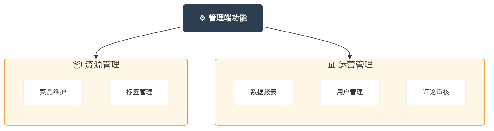
```mermaid
graph TD
    AdminRoot["⚙️ 管理端功能"]
    
    subgraph Resource [📦 资源管理]
        direction TB
        Res1["菜品维护"]
        Res2["标签管理"]
    end
    
    subgraph Operation [📊 运营管理]
        direction TB
        Op1["数据报表"]
        Op2["用户管理"]
        Op3["评论审核"]
    end

    AdminRoot --> Resource
    AdminRoot --> Operation
    
    classDef rootStyle fill:#2c3e50,color:#fff,stroke:none,font-size:14px,font-weight:bold,rx:5px;
    classDef subStyle fill:#fff7e6,stroke:#fa8c16,stroke-width:1px,rx:5px;
    classDef itemStyle fill:#fff,stroke:#eee,stroke-width:1px,font-size:12px,rx:3px;
    
    class AdminRoot rootStyle;
    class Resource,Operation subStyle;
    class Res1,Res2,Op1,Op2,Op3 itemStyle;
```

#### 1.3 非功能需求

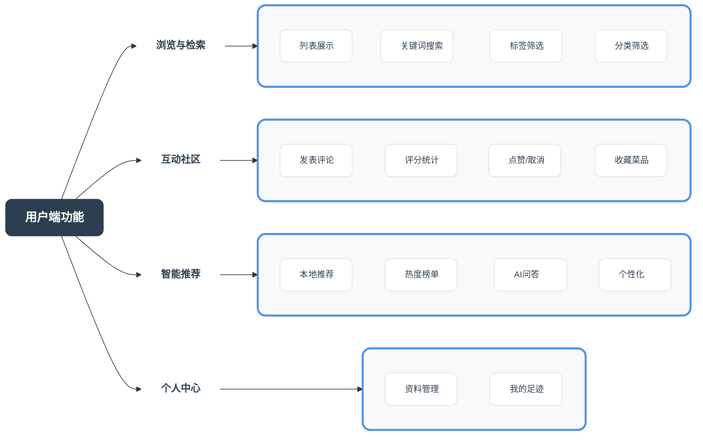
```mermaid
graph LR
    UserRoot["用户端功能"]
    
    BrowseTitle["浏览与检索"]
    subgraph Browse [ ]
        direction TB
        B1["列表展示"]
        B2["关键词搜索"]
        B3["标签筛选"]
        B4["分类筛选"]
    end
    
    InteractTitle["互动社区"]
    subgraph Interact [ ]
        direction TB
        I1["发表评论"]
        I2["评分统计"]
        I3["点赞/取消"]
        I4["收藏菜品"]
    end
    
    RecTitle["智能推荐"]
    subgraph Rec [ ]
        direction TB
        R1["本地推荐"]
        R2["热度榜单"]
        R3["AI问答"]
        R4["个性化"]
    end
    
    PersonalTitle["个人中心"]
    subgraph Personal [ ]
        direction TB
        P1["资料管理"]
        P2["我的足迹"]
    end

    UserRoot --> BrowseTitle
    UserRoot --> InteractTitle
    UserRoot --> RecTitle
    UserRoot --> PersonalTitle
    
    BrowseTitle --> Browse
    InteractTitle --> Interact
    RecTitle --> Rec
    PersonalTitle --> Personal
    
    classDef rootStyle fill:#2c3e50,color:#fff,stroke:none,font-size:18px,font-weight:bold,rx:10px,text-align:center;
    classDef titleStyle fill:transparent,stroke:none,font-size:15px,font-weight:bold,color:#2c3e50,text-align:center;
    classDef subContainerStyle fill:#f8f9fa,stroke:#4a90e2,stroke-width:3px,rx:12px,text-align:center;
    classDef itemStyle fill:#ffffff,stroke:#e0e0e0,stroke-width:1px,font-size:13px,rx:8px,color:#2c3e50,width:110px,text-align:center,white-space:nowrap,overflow:hidden,text-overflow:ellipsis;
    
    class UserRoot rootStyle;
    class BrowseTitle,InteractTitle,RecTitle,PersonalTitle titleStyle;
    class Browse,Interact,Rec,Personal subContainerStyle;
    class B1,B2,B3,B4,I1,I2,I3,I4,R1,R2,R3,R4,P1,P2 itemStyle;
```

### 2. 系统用例图 (Use Case Diagram)

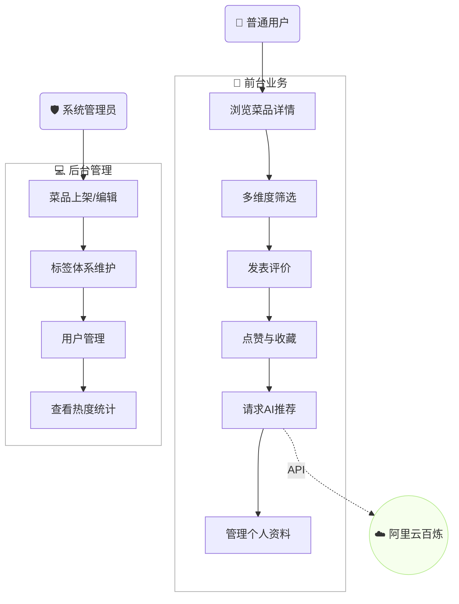
```mermaid
graph TD
    %% 角色定义 (放在顶部或侧边)
    User("👤 普通用户")
    Admin("🛡️ 系统管理员")
    AI(("☁️ 阿里云百炼"))

    %% 1. 前台业务 (垂直列表)
    subgraph FrontEnd [📱 前台业务]
        direction TB
        UC1[浏览菜品详情]
        UC2[多维度筛选]
        UC3[发表评价]
        UC4[点赞与收藏]
        UC5[请求AI推荐]
        UC6[管理个人资料]
    end

    %% 2. 后台管理 (垂直列表，接在前台下面)
    subgraph BackEnd [💻 后台管理]
        direction TB
        UC7[菜品上架/编辑]
        UC8[标签体系维护]
        UC9[用户管理]
        UC10[查看热度统计]
    end

    %% 连接逻辑 - 垂直流向
    User --> UC1
    UC1 --> UC2 --> UC3 --> UC4 --> UC5 --> UC6
    
    %% AI 交互
    UC5 -.->|API | AI
    
    %% 管理员流程
    Admin --> UC7
    UC7 --> UC8 --> UC9 --> UC10

    %% 将两个模块垂直串联起来 (可选，为了视觉更紧凑)
    FrontEnd ~~~ BackEnd

    %% 样式：去除子图背景色，减少视觉宽度感
    style FrontEnd fill:none,stroke:#aaa,stroke-width:1px
    style BackEnd fill:none,stroke:#aaa,stroke-width:1px
    style AI fill:#f6ffed,stroke:#b7eb8f
```

### 3. 系统逻辑架构图 (Logical Architecture)

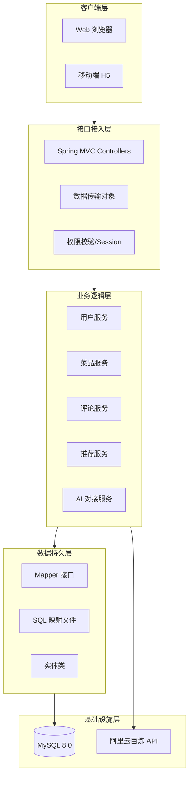
```mermaid
graph TD
    subgraph Client[客户端层]
        Browser[Web 浏览器]
        Mobile[移动端 H5]
    end
    
    subgraph Gateway[接口接入层]
        Controller[Spring MVC Controllers]
        DTO[数据传输对象]
        Auth[权限校验/Session]
    end
    
    subgraph Service[业务逻辑层]
        UserService[用户服务]
        DishService[菜品服务]
        CommentService[评论服务]
        RecService[推荐服务]
        AiService[AI 对接服务]
    end
    
    subgraph Data[数据持久层]
        MyBatis[Mapper 接口]
        XML[SQL 映射文件]
        Entity[实体类]
    end
    
    subgraph Infrastructure[基础设施层]
        MySQL[(MySQL 8.0)]
        Aliyun[阿里云百炼 API]
    end
    
    Client --> Gateway
    Gateway --> Service
    Service --> Data
    Service --> Aliyun
    Data --> MySQL
```

### 4. 业务流程泳道图 (Business Process Swimlane)

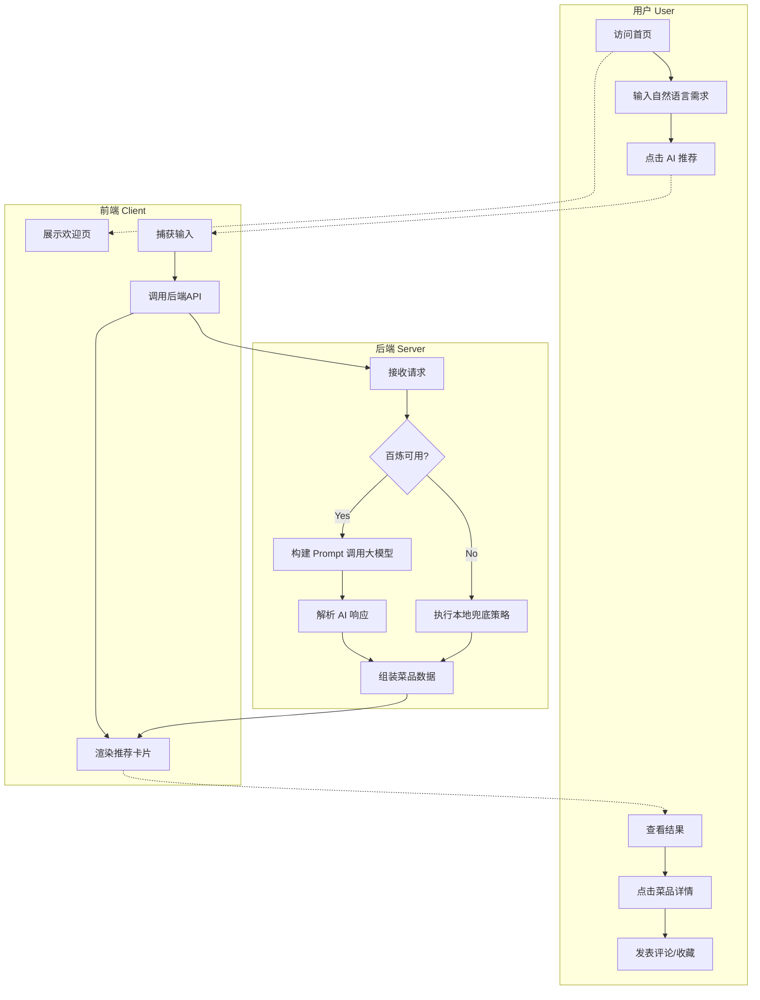
```mermaid
graph TB
    subgraph User[用户 User]
        U1[访问首页] --> U2[输入自然语言需求]
        U2 --> U3[点击 AI 推荐]
        U5[查看结果] --> U6[点击菜品详情]
        U6 --> U7[发表评论/收藏]
    end
    
    subgraph Frontend[前端 Client]
        F1[展示欢迎页]
        F2[捕获输入]
        F3[调用后端API]
        F4[渲染推荐卡片]
        U1 -.-> F1
        U3 -.-> F2
        F2 --> F3
        F3 --> F4
        F4 -.-> U5
    end
    
    subgraph Backend[后端 Server]
        B1[接收请求]
        B2{百炼可用?}
        B3[构建 Prompt 调用大模型]
        B4[解析 AI 响应]
        B5[执行本地兜底策略]
        B6[组装菜品数据]
        F3 --> B1
        B1 --> B2
        B2 -- Yes --> B3
        B3 --> B4
        B4 --> B6
        B2 -- No --> B5
        B5 --> B6
        B6 --> F4
    end
```

### 5. 功能时序图 (Functional Sequence Diagrams) - 核心模块

#### 模块一：用户登录流程
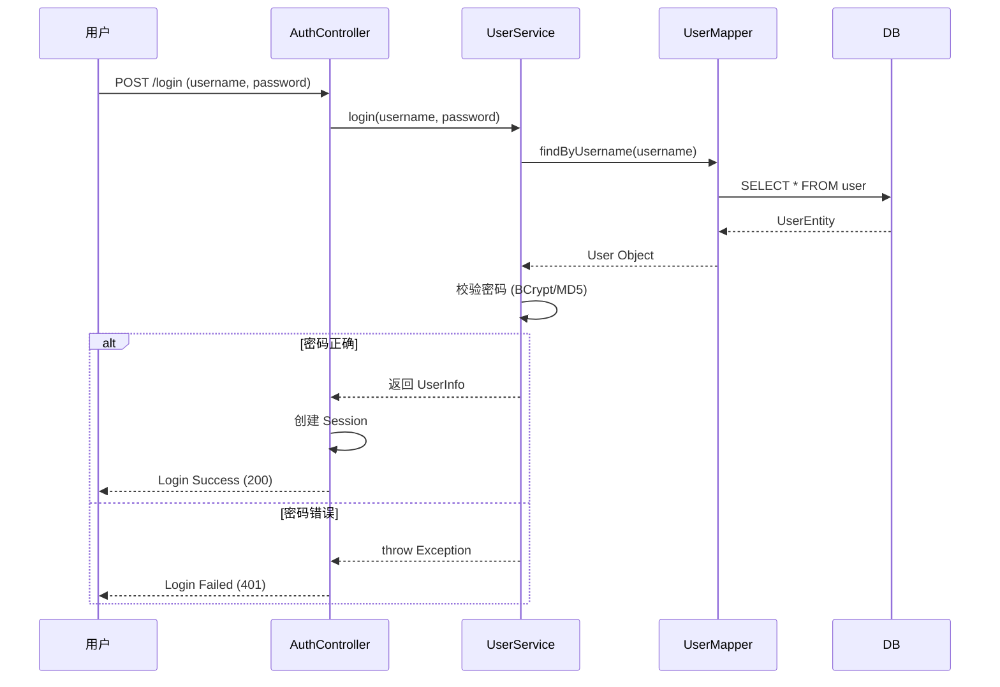
```mermaid
sequenceDiagram
    participant U as 用户
    participant C as AuthController
    participant S as UserService
    participant M as UserMapper
    participant D as DB

    U->>C: POST /login (username, password)
    C->>S: login(username, password)
    S->>M: findByUsername(username)
    M->>D: SELECT * FROM user
    D-->>M: UserEntity
    M-->>S: User Object
    S->>S: 校验密码 (BCrypt/MD5)
    alt 密码正确
        S-->>C: 返回 UserInfo
        C->>C: 创建 Session
        C-->>U: Login Success (200)
    else 密码错误
        S-->>C: throw Exception
        C-->>U: Login Failed (401)
    end
```

#### 模块二：菜品多维筛选流程
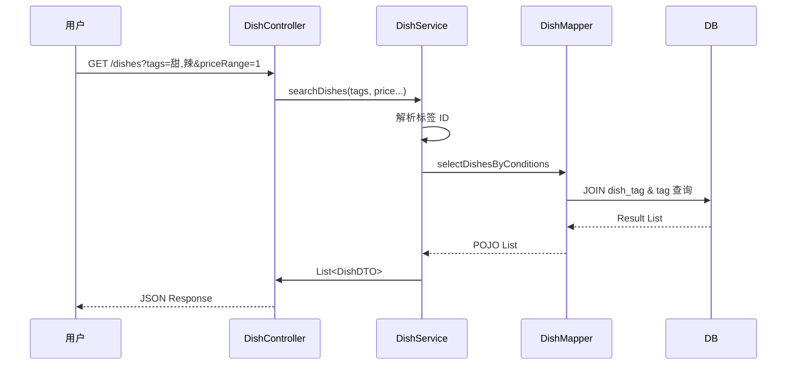
```mermaid
sequenceDiagram
    participant U as 用户
    participant C as DishController
    participant S as DishService
    participant M as DishMapper
    participant D as DB

    U->>C: GET /dishes?tags=甜,辣&priceRange=1
    C->>S: searchDishes(tags, price...)
    S->>S: 解析标签 ID
    S->>M: selectDishesByConditions
    M->>D: JOIN dish_tag & tag 查询
    D-->>M: Result List
    M-->>S: POJO List
    S->>C: List<DishDTO>
    C-->>U: JSON Response
```

#### 模块三：发表评论流程
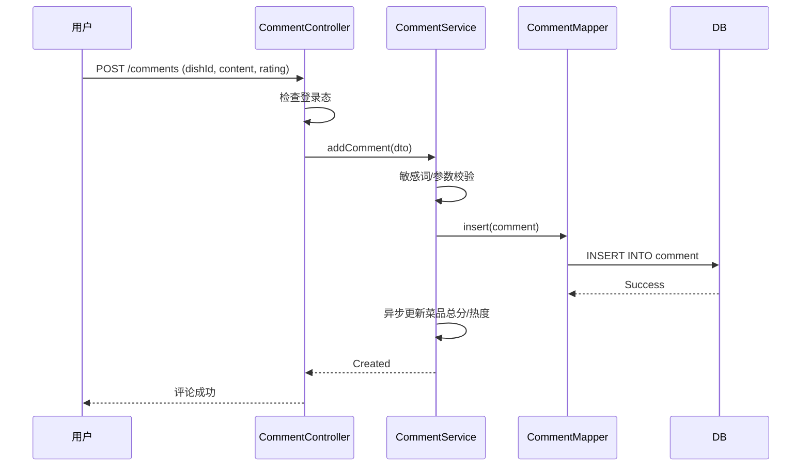
```mermaid
sequenceDiagram
    participant U as 用户
    participant C as CommentController
    participant S as CommentService
    participant M as CommentMapper
    participant D as DB

    U->>C: POST /comments (dishId, content, rating)
    C->>C: 检查登录态
    C->>S: addComment(dto)
    S->>S: 敏感词/参数校验
    S->>M: insert(comment)
    M->>D: INSERT INTO comment
    D-->>M: Success
    S->>S: 异步更新菜品总分/热度
    S-->>C: Created
    C-->>U: 评论成功
```

#### 模块四：AI 智能推荐流程
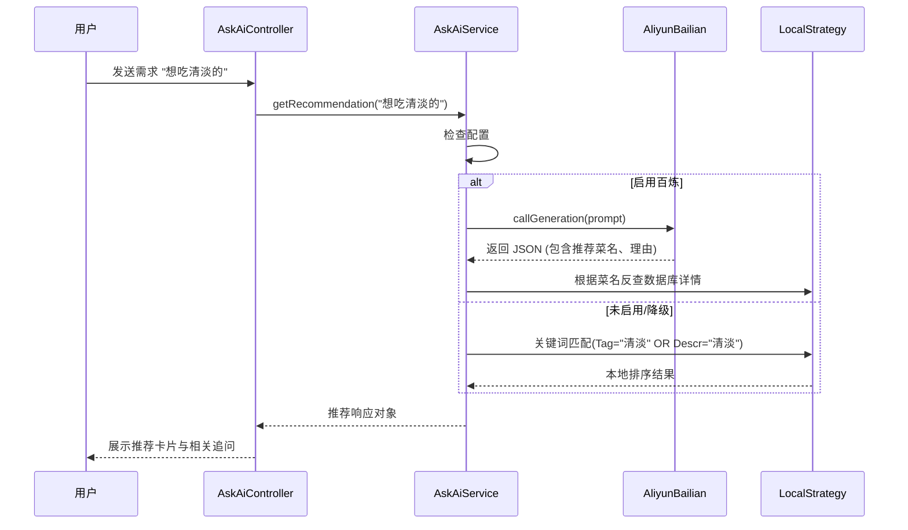
```mermaid
sequenceDiagram
    participant U as 用户
    participant C as AskAiController
    participant S as AskAiService
    participant A as AliyunBailian
    participant L as LocalStrategy

    U->>C: 发送需求 "想吃清淡的"
    C->>S: getRecommendation("想吃清淡的")
    S->>S: 检查配置
    alt 启用百炼
        S->>A: callGeneration(prompt)
        A-->>S: 返回 JSON (包含推荐菜名、理由)
        S->>L: 根据菜名反查数据库详情
    else 未启用/降级
        S->>L: 关键词匹配(Tag="清淡" OR Descr="清淡")
        L-->>S: 本地排序结果
    end
    S-->>C: 推荐响应对象
    C-->>U: 展示推荐卡片与相关追问
```

#### 模块五：管理员数据统计
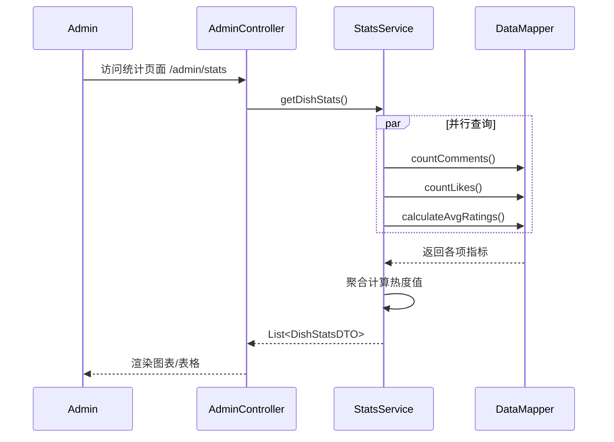
```mermaid
sequenceDiagram
    participant Admin
    participant C as AdminController
    participant S as StatsService
    participant M as DataMapper
    
    Admin->>C: 访问统计页面 /admin/stats
    C->>S: getDishStats()
    par 并行查询
        S->>M: countComments()
        S->>M: countLikes()
        S->>M: calculateAvgRatings()
    end
    M-->>S: 返回各项指标
    S->>S: 聚合计算热度值
    S-->>C: List<DishStatsDTO>
    C-->>Admin: 渲染图表/表格
```

### 6. 数据库 E-R 图 (Entity-Relationship Diagram)

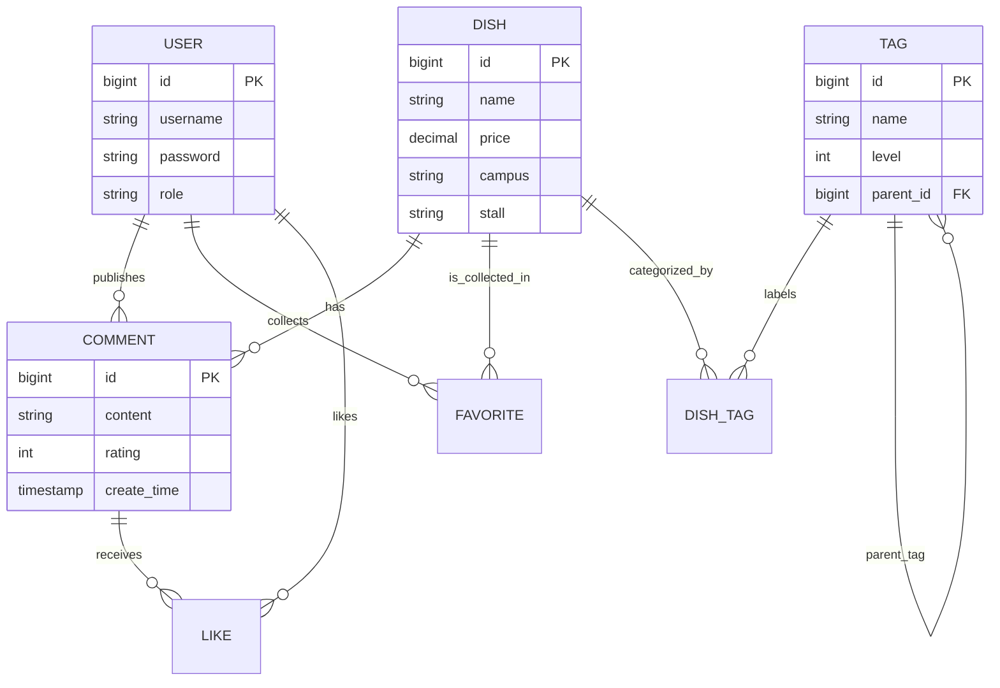
```mermaid
erDiagram
    USER ||--o{ COMMENT : "publishes"
    USER ||--o{ FAVORITE : "collects"
    USER ||--o{ LIKE : "likes"
    
    DISH ||--o{ COMMENT : "has"
    DISH ||--o{ FAVORITE : "is_collected_in"
    DISH ||--o{ DISH_TAG : "categorized_by"
    
    TAG ||--o{ DISH_TAG : "labels"
    TAG ||--o{ TAG : "parent_tag"
    
    COMMENT ||--o{ LIKE : "receives"

    USER {
        bigint id PK
        string username
        string password
        string role
    }
    DISH {
        bigint id PK
        string name
        decimal price
        string campus
        string stall
    }
    COMMENT {
        bigint id PK
        string content
        int rating
        timestamp create_time
    }
    TAG {
        bigint id PK
        string name
        int level
        bigint parent_id FK
    }
```

### 7. 活动图：管理员菜品管理 (Activity Diagram)

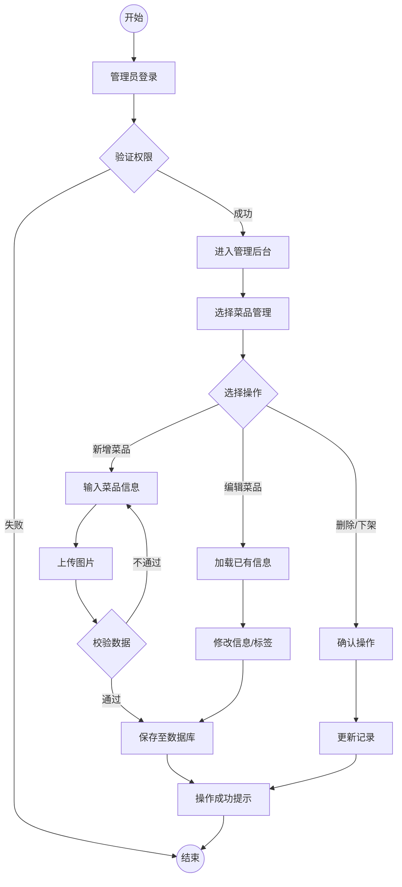
```mermaid
graph TD
    Start((开始)) --> Login[管理员登录]
    Login --> Verify{验证权限}
    Verify -- 失败 --> End((结束))
    Verify -- 成功 --> Dash[进入管理后台]
    Dash --> Select[选择菜品管理]
    Select --> Action{选择操作}
    
    Action -- 新增菜品 --> Input[输入菜品信息]
    Input --> Img[上传图片]
    Img --> Valid{校验数据}
    Valid -- 不通过 --> Input
    Valid -- 通过 --> Save[保存至数据库]
    
    Action -- 编辑菜品 --> Load[加载已有信息]
    Load --> Edit[修改信息/标签]
    Edit --> Save
    
    Action -- 删除/下架 --> Confirm[确认操作]
    Confirm --> UpdateStatus[更新记录]
    
    Save --> Success[操作成功提示]
    UpdateStatus --> Success
    Success --> End
```

### 8. 系统物理拓扑图 (Physical Topology)

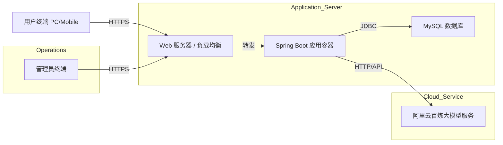
```mermaid
graph LR
    UserDev[用户终端 PC/Mobile] -- HTTPS --> Nginx[Web 服务器 / 负载均衡]
    
    subgraph Application_Server
        Nginx -- 转发 --> Boot[Spring Boot 应用容器]
        Boot -- JDBC --> MySQL[MySQL 数据库]
    end
    
    subgraph Cloud_Service
        Boot -- HTTP/API --> Aliyun[阿里云百炼大模型服务]
    end
    
    subgraph Operations
        AdminDev[管理员终端] -- HTTPS --> Nginx
    end
```

---

## 答辩用创新点总结 (Key Innovations)

### 1. "AI + 餐饮" 的深度融合场景
不同于传统的基于简单规则的推荐，本系统引入了大语言模型（LLM）能力。
- **自然语言理解**：用户无需勾选复杂的复选框，直接说 "我想吃清淡点" 或 "最近在减肥"，系统即可理解并转化为标签筛选条件。
- **多模态降级策略**：设计了 "云端大模型优先 + 本地规则兜底" 的双保险机制，既保证了智能化体验，又确保了系统在无外网或 API 异常时的可用性。
- **交互式悬浮助手**：参考了主流 AI 应用的交互形态，开发了全站通用的悬浮对话组件，由简单的 "页面级功能" 升级为 "伴随式助手"。

### 2. 精细化的多级标签体系
构建了树状结构的标签系统（`Tag Tree`），打破了传统单一维度的分类。
- **维度丰富**：涵盖品类（面食/米饭）、口味（辣/甜/咸）、健康（高蛋白/低卡）、场景（一人食/聚餐）等。
- **数据驱动**：标签不仅用于展示，更是 AI 推荐引擎计算 "匹配度（Match Score）" 的核心因子。

### 3. 可视化与实时数据分析
在管理后台实现了现代化的数据洞察能力。
- **前端实时排序**：针对 "评论数"、"平均分"、"热度值" 等关键指标，实现了无延迟的前端排序，帮助管理者快速发现 "爆款" 与 "问题菜品"。
- **健康度监控**：集成了服务器资源（CPU/内存）与数据库连接池状态的实时打点，贴近生产环境运维标准。

### 4. 完整的工程化实践
系统并非简单的 CRUD 堆砌，而是包含了完整的工程链路。
- **统一异常处理**：全局的错误拦截与友好的前端反馈。
- **模块化设计**：Controller/Service/Mapper 分层清晰，Restful API 风格规范。
- **安全机制**：基于 Filter/Interceptor 的登录态拦截与管理员权限鉴权。


